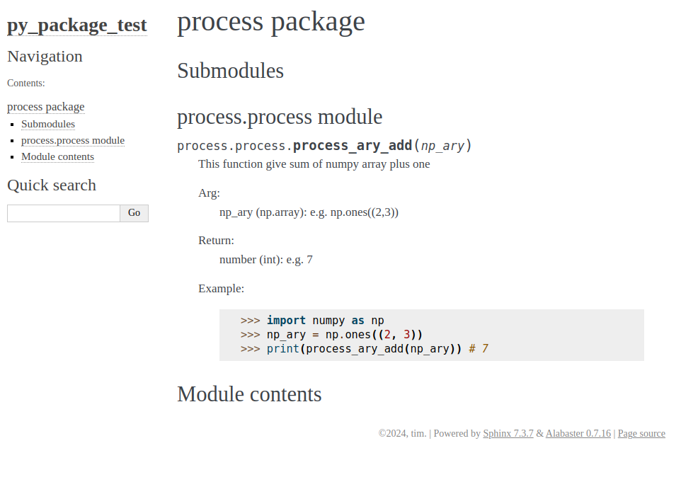

# Python Package Test Docs

## Environment
- Ubuntu20.04
- sphinx

## Introduction
We build a very simple python package to calculate the sum value of a array plus one. The package APIs is documented into html form by using sphinx. The package is could be installed by pip locally or remotely, and it is uploaded into testpypi.

## Demonstration

- [Install Python Package](https://test.pypi.org/project/timsingsing-py-package-test/)
- [Sphinx-generated HTML](./html/index.html)
- 

## Reference

- [How to Create and Upload Your First Python Package to PyPI](https://www.freecodecamp.org/news/how-to-create-and-upload-your-first-python-package-to-pypi/)
- [Build Your First Python Package with pyproject.toml](https://medium.com/@codebyteexplorer/build-your-first-python-package-with-pyproject-toml-19e2119edbca)
- [Packaging Python Projects](https://packaging.python.org/en/latest/tutorials/packaging-projects/)
- [隨手養成 Python 好習慣－勤註解、善用自動文件產生工具 Sphinx](https://myapollo.com.tw/blog/python-autodoc/)
